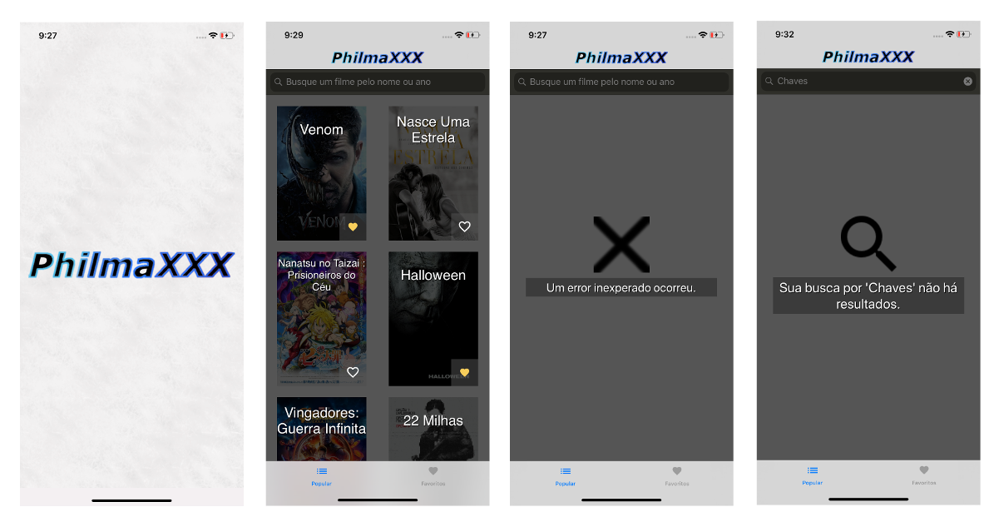
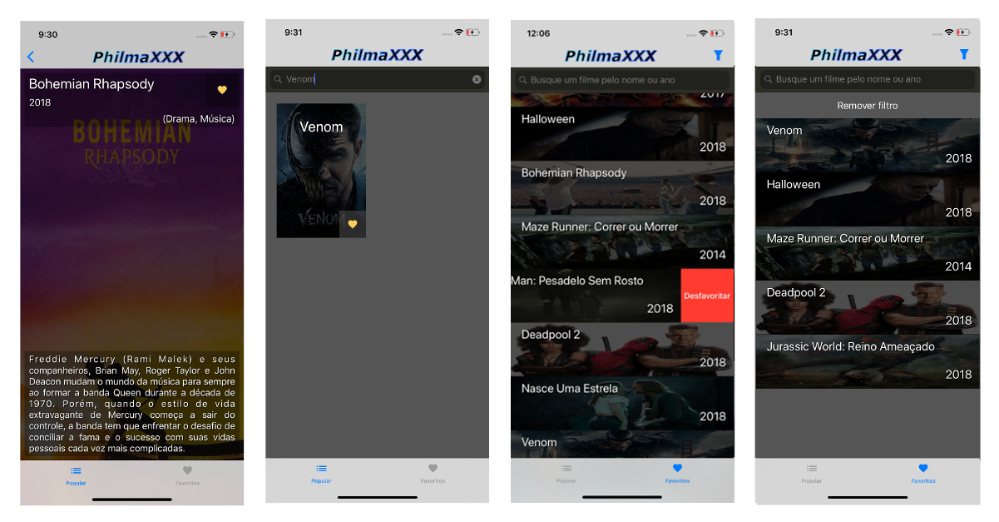
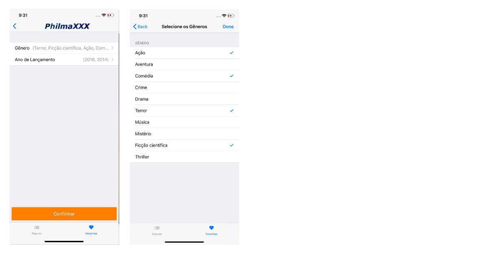

# Concrete iOS Recruit Challenge - Guilherme 'Heaven' Guimarães Submission

---

## Bem vindo

---

Agradeço por poder participar do Recruiting Day da Concrete. Foi uma honra conhecer várias pessoas talentodas nas suas várias áreas de atuação e experiências.

## Afinal, o que é esse desafio?

---

Como já explicado no branch original, utilizando a [API](https://developers.themoviedb.org/3/getting-started/introduction) do [TheMovieDB](https://www.themoviedb.org/?language=en) foi feito o PhilmaXXX, minha submissão para o desafio. O planejamento e exeução do projeto pode ser acompanhado através do [mural Trello](https://trello.com/b/C317xMAo/concrete-ios-recruiting-guilherme-guimar%C3%A3es-project-philmaxxx) publicamente visível à todos.

Esse projeto foi executado utilizando a arquitetura de projetos Clean Archtecture, com suas camadas de Domínio, Plataforma e Aplicação modularizados por targets, reforçando a importância do encapsulamento para a organização de projetos. Também foi utilizado nesse projeto:

- Padrões de projeto criacionais como Abstract Factory, Lazy Init, Dependency Injection, Prototype.
- Padrão de navegação utilizado foi o Navigator.

O projeto foi desenvolvido no 4 utilizando o iOS 12. As APIs utilizadas foram:

- Kingfisher (gerenciamente de image-set com auto-cache)
- Eureka (criação de formulário, utilizado na tela de filtros)
- Quick & Nimble (testes)

Até o final do projeto deve ser adotado:
- Kif

# Features incluídas ..

---

### Precisava ter:

- [x] Tela de Splash;
- [x] Layout em abas, contendo na primeira aba a tela de grid de filmes e na segunda aba a tela de lista de filmes favoritados no app;
- [x] Tela de grid de filmes trazendo a lista de filmes populares da [API](https://developers.themoviedb.org/3/movies/get-popular-movies).
- [x] Tratamento de erros e apresentação dos fluxos de exceção: Busca vazia, Error generico, loading;
- [x] Ao clicar em um filme do grid deve navegar para a tela de detalhe do filme;
- [x] Tela de Detalhe do filme deve conter ação para favoritar o filme;
- [x] Tela de Detalhe do filme deve conter gênero do filme por extenso (ex: Action, Horror, etc); Use esse [request](https://developers.themoviedb.org/3/genres/get-movie-list) da API para trazer a lista.
- [x] Tela de lista de favoritos persistido no app entre sessões;
- [x] Tela de favoritos deve permitir desfavoritar um filme.

### Ganhava mais pontos se tiver:

- [x] Tela de grid com busca local;
- [x] Scroll Infinito para fazer paginação da API de filmes populares;
- [x] Célula do Grid de filmes com informação se o filme foi favoritado no app ou não;
- [x] Tela de filtro com seleção de data de lançamento e gênero. A tela de filtro só é acessível a partir da tela de favoritos;
- [x] Ao Aplicar o filtro, retornar a tela de favoritos e fazer um filtro local usando as informações selecionadas referentes a data de lançamento e gênero;
- [x] Testes unitários no projeto;
- [ ] Testes funcionais. (ainda)
- [ ] Pipeline Automatizado (ainda)

### Detalhes:

- [x] Proteção de Request Spam.

## - PS: Ainda pendente pra pull. Acontecerá até esse fim de Sábado.

# Exemplos e sugestões

---

### Fluxo com Slash e grid de filmes

### Fluxo com Splash, Tela de Detalhes e tela de lista da favoritos

### Fluxo Opcional de filtro

## **Processo de submissão**

---

Agradeço pela atenção na leitura. Tenha um ótimo dia.
