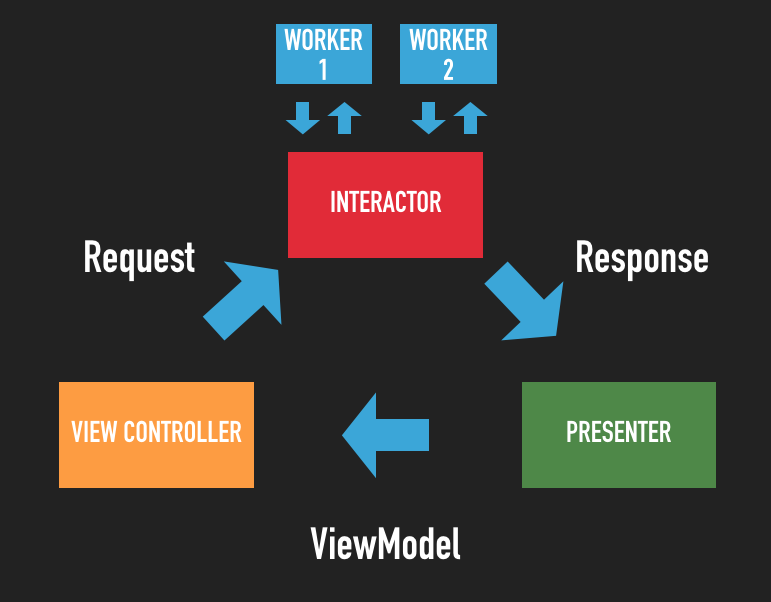

# Movs iOS Application

## Projeto

---

### Features:

- Tela de Splash;
- Layout em abas, contendo na primeira aba a tela de grid de filmes e na segunda aba a tela de lista de filmes favoritados no app;
- Tela de grid de filmes trazendo a lista de filmes populares da [API](https://developers.themoviedb.org/3/movies/get-popular-movies).
- Tratamento de erros e apresentação dos fluxos de exceção: Busca vazia, Error generico, loading;
- Ao clicar em um filme do grid deve navegar para a tela de detalhe do filme;
- Tela de Detalhe do filme deve conter ação para favoritar o filme;
- Tela de Detalhe do filme deve conter gênero do filme por extenso (ex: Action, Horror, etc); Use esse [request](https://developers.themoviedb.org/3/genres/get-movie-list) da API para trazer a lista.
- Tela de lista de favoritos persistido no app entre sessões;
- Tela de favoritos deve permitir desfavoritar um filme.
- Tela de grid com busca local;
- Scroll Infinito para fazer paginação da API de filmes populares;
- Célula do Grid de filmes com informação se o filme foi favoritado no app ou não;
- Tela de filtro com seleção de data de lançamento e gênero. A tela de filtro só é acessível a partir da tela de favoritos;
- Ao Aplicar o filtro, retornar a tela de favoritos e fazer um filtro local usando as informações selecionadas referentes a data de lançamento e gênero;
- Testes unitários;

### Arquitetura

Arquitetura utilizada no projeto foi a [clean-swift](https://clean-swift.com/) do Uncle Bob:

### Dependency Manager

Gerenciador de dependencias utilizada no projeto foi o [Cocoapods](https://cocoapods.org/). Link para instalação e execução do cocoapods só seguir o [tutorial](https://cocoapods.org/).

### Network

Camada de abstração de rede utilizada no projeto foi o [Moya](https://github.com/Moya/Moya) e para download de imagem o [Kingfisher](https://github.com/onevcat/Kingfisher).

### Database

Camada de banco de dados utilizada no projeto foi o [Realm](https://realm.io/).

### Unit tests

Para testar os componentes seria utilizado os testes de [snapshot](https://github.com/pointfreeco/swift-snapshot-testing) e para os demais testes o [XCTest](https://developer.apple.com/documentation/xctest), utilizando Spies auto gerado pelo [Mock Generator](https://github.com/seanhenry/SwiftMockGeneratorForXcode) e para gerar dados de teste o [Fakery](https://github.com/vadymmarkov/Fakery).

### Instruments tests

Para testes instrumentados seria utilizado o [XCTest](https://developer.apple.com/documentation/xctest) na arquitetura de Page Object.

### Page Object Pattern

