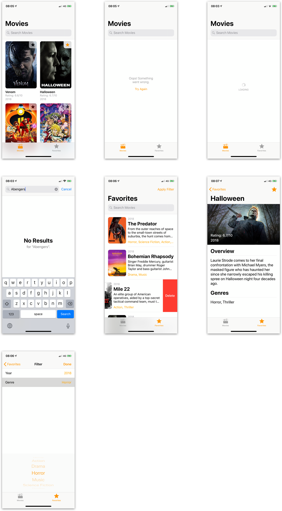

The Movies App is a themoviedb.org [API](https://www.themoviedb.org/documentation/api) client for iPhone with an iOS centric UI made for the [Concrete iOS Recruit Challenge](https://github.com/concretesolutions/ios-recruiting-brazil).


## Installing

This project uses CocoaPods. Before you run, you need to:

```
cd Movies/
pod install
open Movies.xcworkspace/
```

## Appearance

### Splash Screen

<h3 align="center">
  
</h3>

### Flow

<h3 align="center">
  
</h3>

## Built With

* [Cocoapods](https://cocoapods.org) - Dependency Management
* [Alamofire](https://github.com/Alamofire/Alamofire) - HTTP networking library
* [SDWebImage](https://github.com/SDWebImage/SDWebImage) - Async image downloader with cache support
* [SnapKit](http://snapkit.io) - Auto Layout DSL
* [Reusable](https://github.com/AliSoftware/Reusable) - A Swift mixin to use UITableViewCells, UICollectionViewCells and UIViewControllers in a type-safe way
* [iOS Lottie](https://github.com/airbnb/lottie-ios) - An iOS library to natively render After Effects vector animations
* [SwiftLint](https://github.com/realm/SwiftLint) - A tool to enforce Swift style and conventions
* [SwiftyJSON](https://github.com/SwiftyJSON/SwiftyJSON) - JSON parser in swift

## License

This project is licensed under the MIT License - see the [LICENSE.md](LICENSE.md) file for details

## Acknowledgments

* Star icon made by Revicon from www.flaticon.com 
* Clapperboard icon made by Freepik from www.flaticon.com 
* Thanks to the [Concrete Solutions](https://www.concrete.com.br/blog) for the challenge.


