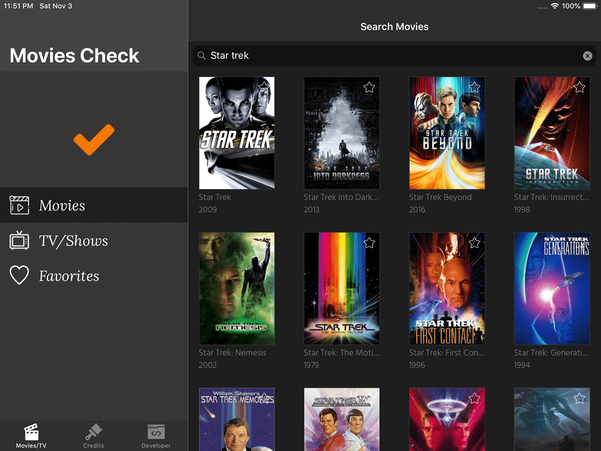
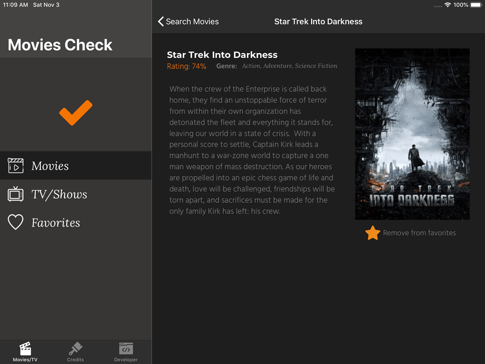
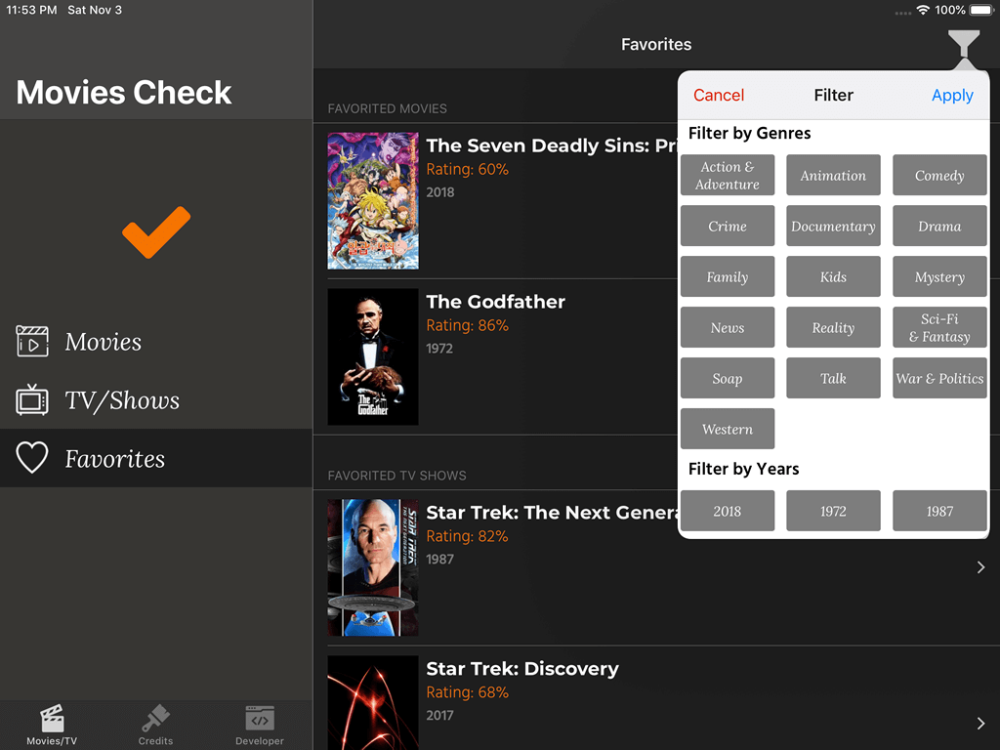

# MoviesCheck

## About the project

---

MoviesCheck is an iOS app designed for iPhones and iPads built using the Clean Swift Architecture and taking advantage of UISplitViewController to ensure a better user experience differentiated for both the iPad and the iPhone.

# Features ..

---
- Custom Fonts;
- Usage of visual language to create constraints;
- Usage of vary for traits constraints;
- Asynchronous image loading;
- Asynchronous Image caching using iOS native FileManager (Without use of external framework);
- Database management using Realm (The only external framework used in this project);
- Usage of UISplitViewController;
- Designed to be used with iPhone and iPad, with differential design for each type of device;
- Infinite Scrooling pagination in the Most Popular movies and tv shows collectionview
- Infinite Scrooling pagination when searching for movies and tv shows

# App Previews

---

### iPad

### iPhone

