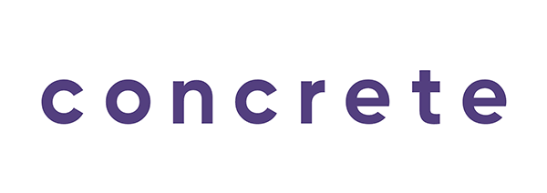

# Concrete iOS Recruit Challenge

---

---

# The Movies App

Aplicação realizada para consulta de filmes populares e como ferramenta auxiliar para a marcação de favoritos do mesmo.

## Aplicação
      

**Obs.: Toque no coração para desfavoritar**

### Arquitetura Clean

Buscando a melhor forma de se trabalhar foi escolhida a arquitetura clean buscando a maior independencia possível dos módulos, algumas pequenas alterações foram feitas para facilitar a ligação entre os módulos e para tal tarefa foi escolhido o uso do **RxSwift**, possibilitando um fluxo fácil de compreender e removendo assim possíveis dependências cruzadas. Também foram utilizadas outras ferramentas como **Snapkit** para auxiliar na construção das views (neste projeto foi utilizado o view coding) e **Swinject** para auxiliar na construção dos módulos principais (Apresentação, Caso de Uso, e Data). Para a possível automatização de deploy, testes, distribuição beta e screenshots foi escolhido o **Fastlane**.

