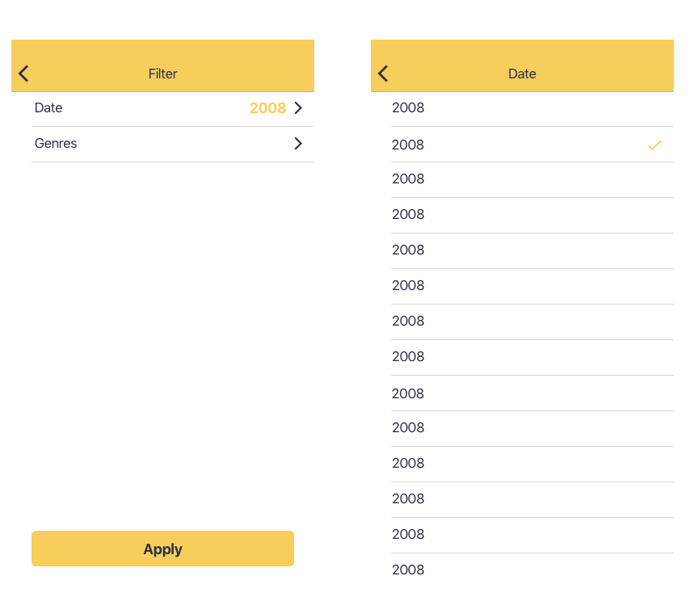

# Concrete iOS Recruit Challenge

---

## Bem vindo

---

Obrigado por participar do desafio iOS da Concrete! Estamos muito contentes pelo seu primeiro passo para fazer parte de um time excepcional.

## Afinal, o que é esse desafio?

---

Você deverá criar uma app sobre filmes, usando a [API](https://developers.themoviedb.org/3/getting-started/introduction) do [TheMovieDB](https://www.themoviedb.org/?language=en). Legal, certo? Para dar uma padronizada e ter um layout minimamente definido anexamos alguns assets que vão te ajudar a desenvolver esse app:

- [Ícones do app](assets/appIcons)
- [ScreenShots](assets/screenshots)
- [Ícones](assets/icons)

Pense no desafio como uma oportunidade de mostrar todo o seu conhecimento. E faça com calma, você tem uma semana para entregar!
Vamos avaliar como você lida com casos de:

- Consumo de APIs
- Persistência de dados (Favoritos)
- Lógicas de filtros e buscas.
- Estruturação de layout e fluxo de aplicação.

O único pré-requisito é que o código seja feito em Swift, de preferência na versão mais atual. Sinta-se a vontade para:

- Usar ou não usar bibliotecas
- Estruturar seu layout com storyboards, xibs ou ViewCode
- Adotar a arquitetura que você quiser.

Somos especialmente preocupados com qualidade e acreditamos bastante em testes automatizados. Entretanto, sabemos que não é um tópico dominado por todos, por isso aceitamos desafios com todos os perfis e diferentes momentos de experiência e conhecimento técnico.
Para posições mais Seniors, porém, damos muito importância para a qualidade do código.

# Features ..

---

### Precisa ter:

- Tela de Splash;
- Layout em abas, contendo na primeira aba a tela de grid de filmes e na segunda aba a tela de lista de filmes favoritados no app;
- Tela de grid de filmes trazendo a lista de filmes populares da [API](https://developers.themoviedb.org/3/movies/get-popular-movies).
- Tratamento de erros e apresentação dos fluxos de exceção: Busca vazia, Error generico, loading;
- Ao clicar em um filme do grid deve navegar para a tela de detalhe do filme;
- Tela de Detalhe do filme deve conter ação para favoritar o filme;
- Tela de Detalhe do filme deve conter gênero do filme por extenso (ex: Action, Horror, etc); Use esse [request](https://developers.themoviedb.org/3/genres/get-movie-list) da API para trazer a lista.
- Tela de lista de favoritos persistido no app entre sessões;
- Tela de favoritos deve permitir desfavoritar um filme.

### Ganha mais pontos se tiver:

- Tela de grid com busca local;
- Scroll Infinito para fazer paginação da API de filmes populares;
- Célula do Grid de filmes com informação se o filme foi favoritado no app ou não;
- Tela de filtro com seleção de data de lançamento e gênero. A tela de filtro só é acessível a partir da tela de favoritos;
- Ao Aplicar o filtro, retornar a tela de favoritos e fazer um filtro local usando as informações selecionadas referentes a data de lançamento e gênero;
- Testes unitários no projeto;
- Testes funcionais.
- Pipeline Automatizado

# Exemplos e sugestões

---

Abaixo podemos ver algumas telas de exemplo de alguns desses fluxos. São apenas sugestões, fique à vontade para modificar como você quiser.
Para facilitar o processo, existem assets, app icons, ícones e paleta de cores no repositório. Mas se o seu lado designer falar mais alto, pode nos surpreender!

### Fluxo de grid de filmes

### Fluxo com Splash, Tela de Detalhes e tela de lista da favoritos

### Fluxo Opcional de filtro

## **Processo de submissão**

---

Depois de implementar a solução, envie um pull request para este repositório.
O processo de Pull Request funciona da seguinte maneira:

1. Faça um fork deste repositório (não clonar direto!);
2. Faça seu projeto neste fork;
3. Commit e suba as alterações para o **SEU** fork;
4. Pela interface do Github, envie um Pull Request.

Deixe o fork público para facilitar a inspeção do código.

### **ATENÇÃO**

Não tente fazer o PUSH diretamente para ESTE repositório!
